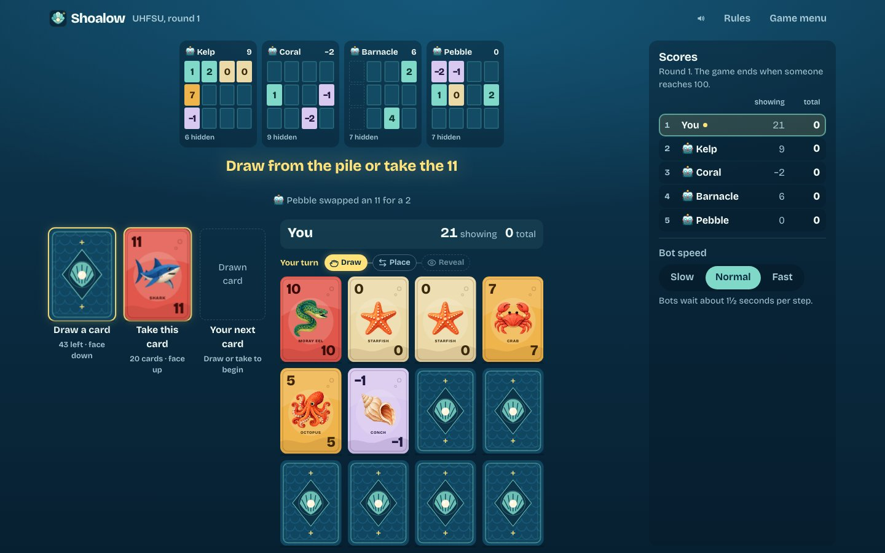
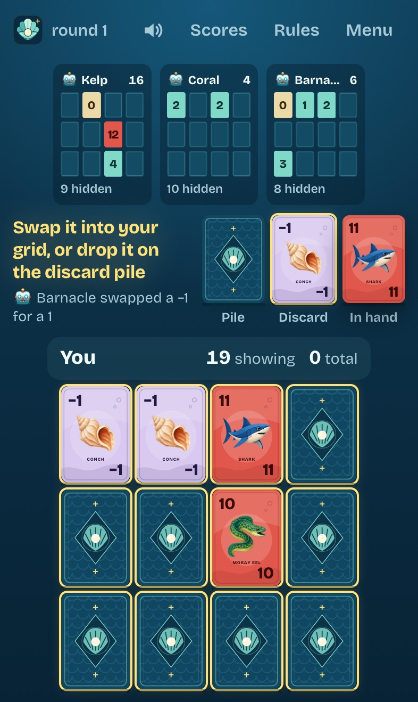

# Shoalow

A deep-sea card game for 2 to 10 players, right in the browser. Everyone keeps a hidden grid of
twelve cards and tries to finish with the lowest score: pearls are worth −2, the grumpy anglerfish
costs 12, and three equal cards in a column vanish.

**[Play Shoalow](https://shoalow.fly.dev)**. There's nothing to install and no account to create.
It works on a computer, an iPhone, an iPad or an Android phone.

<p align="center">
  
  &nbsp;
  
</p>

## Start a game

1. Open [shoalow.fly.dev](https://shoalow.fly.dev), enter your name and choose **Create a table**.
2. Send the others the invite link, or tell them the five-letter table code.
3. Add bots if you like: **Easy** makes loose, beatable choices, and **Normal** keeps low cards
   and hunts for columns.
4. Pick a score goal and how fast bots move, then start.

Want to play alone? Add a bot or two and start. New to the game? **Learn with a practice game**
deals you a round against one bot, with a coach explaining each step.

## How to play

The rules page in the game explains everything; here is the short version.

- Each player starts with twelve face-down cards and turns two of them over. The deck grows with
  the table, 24 cards per player, so the draw pile runs out late in about half of all rounds at
  any size.
- On your turn, take the top card of the discard pile or draw from the pile. Swap it with any card
  in your grid. A drawn card can instead be dropped on the discard pile, and then you turn over
  one of your face-down cards.
- Three equal face-up cards in a column are cleared away.
- When someone has turned over every card, everyone else gets one more turn. If the player who
  ended the round doesn't have the lowest score on their own, and it's above zero, it counts
  double.
- The game ends after a round in which someone reaches the score goal. The lowest total wins.

Before you start, [meet all fifteen cards](https://shoalow.fly.dev/cards) in the creature gallery.

## On a phone or tablet

The whole table fits on one screen, upright or sideways, so you never scroll during a turn. On a
phone, the other players sit in a row you can swipe; it follows whoever's turn it is. Tap any
player to see their cards larger.

To keep Shoalow on your home screen like an app, open it in Safari, tap **Share** and choose
**Add to Home Screen**. On Android, use Chrome's **Add to home screen**. Invite links still open
in the browser, and on iPhone and iPad the home-screen app keeps its seats apart from Safari, so
join a table from the same place you want to play it.

No sound on an iPhone? Check the silent switch: Shoalow's sounds are muted while the phone is on
silent. The speaker button at the top of the table turns sound on or off.

## At the table

- **Goal and length.** Choose 50 points for a quick game, 100 for a classic one, 200 for a long
  one, or any goal from 10 to 500 with the slider. Setup shows a rough duration for the goal and
  number of players.
- **Running sums.** Normally the table adds up everyone's face-up cards for you. The host can
  hide these sums in the lobby, so counting becomes part of the game. Round scores and totals
  still appear after each round.
- **Coming and going.** Your seat is remembered in the browser. A refresh, a locked phone or a
  dropped connection puts you straight back into the game.
- **Someone had to leave?** The host can tap their tile and let a bot play their cards until
  they come back.
- **Game menu.** Anyone can exit a running game: a bot takes over your cards, and if you were
  hosting, the next player becomes host. You can join again when the table returns to the lobby.
  The host can also stop the game and bring everyone back to the lobby with scores cleared.
- **Bot speed.** Slow, Normal or Fast. The host can change it in the lobby or, during a game, in
  the scores panel.

Tables without play for 30 days are deleted.

## About

Shoalow plays by the rules of the card game Skyjo, which I wanted to play online with colleagues.
It is an independent fan project, not affiliated with Magilano or its publishers. The name, the
artwork, the colours and the rules text are all original. Only the game mechanics, which are not
protected, are shared.

## Develop

Tools are pinned with [mise](https://mise.jdx.dev/): Bun 1.3 for everything, Dagger for CI.

```sh
mise install
mise run install    # bun install
mise run dev        # game server on :3000 and Vite on :5173
mise run check      # Biome, TypeScript, svelte-check, all tests
mise run e2e        # Playwright: a full round in Chromium, the table on iPhone and iPad in WebKit
mise run sim        # 5000 seeded bot games, and 400 tables fed random and hostile messages
mise run icons      # re-render the home-screen icons after changing the logo
mise run ci         # the CI pipeline, locally in Dagger
```

The code is a Bun workspace:

| Path | What it does |
| --- | --- |
| `packages/game` | Pure TypeScript rules engine, per-player views, bots, message types. No I/O. |
| `apps/server` | `Bun.serve` with a small HTTP API, WebSockets, bot turns and SQLite persistence. |
| `apps/web` | Svelte 5 client with the card artwork. |

The engine is deterministic: a game is its seed plus its action log. `viewFor(state, seat)` strips
every face-down value before anything leaves the server, so browsers never receive hidden cards. The
simulation test plays thousands of seeded games and checks card conservation, view secrecy, score
arithmetic, termination and exact replay after every move. A second simulation runs whole tables:
people join, leave and send legal, illegal and malformed messages, and the server restarts from its
snapshots. Every table must keep its invariants and still finish its game. Either kind of failure
prints the command that replays it.

The server is public and needs no account, so it limits each address: how fast it can create, join
and look up tables, how many connections it can hold, and how many messages each connection can
send. It refuses cross-site requests, sends a strict Content Security Policy and caps its own disk
use. When it holds 2,000 tables, the longest-idle table nobody is connected to makes room for a new
one. `apps/server/test/hardening.test.ts` runs these attacks against a real server. The limits are in
`apps/server/src/limits.ts`; [the decision record](decisions/2026-10-02_104749343_limit-abuse-per-client-and-keep-the-server-up-through-bad-in.md)
explains them.

## Deploy

Shoalow runs on a single [Fly.io](https://fly.io) machine that stops when nobody is connected and
starts again on the next visit. Games are saved to SQLite on a volume after every move, so an
unfinished game survives the machine stopping.

```sh
fly apps create shoalow
fly volumes create shoalow_data --region fra --size 1 --yes
mise run deploy     # fly deploy --ha=false
```

Keep it to one machine: game state lives on that machine's volume.

The image is distroless: it holds Bun and the game and nothing else, with no shell or package
manager. Fly mounts the volume owned by root, so the server starts as root only to hand `/data` to
the unprivileged `nonroot` user. It then switches to that user for good, with no capabilities left
and no way back to root. It refuses to run as root otherwise. `mise run ci` starts the image on a
root-owned volume and checks it from outside.

## License

[MIT](LICENSE)
