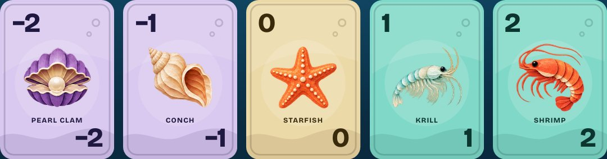
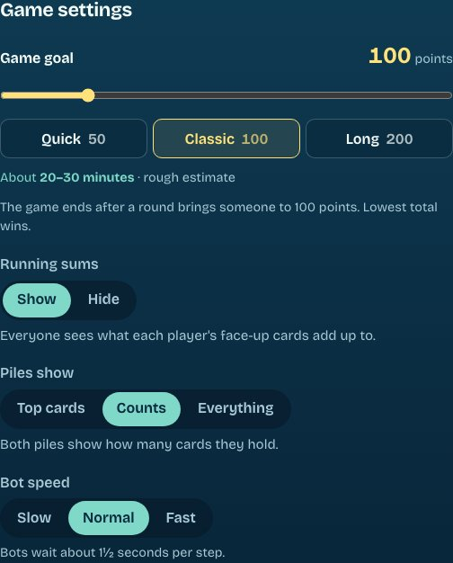

<p align="center">
  
</p>

<h1 align="center">Shoalow</h1>

<p align="center">
  <strong>A deep-sea card game for 2 to 10 players, right in the browser.</strong><br>
  Keep your score low: pearls help, anglerfish hurt, and three of a kind in a column vanish.
</p>

<p align="center">
  <a href="https://shoalow.fly.dev"><strong>Play now at shoalow.fly.dev</strong></a>
  &nbsp;·&nbsp;
  <a href="https://shoalow.fly.dev/cards">Meet the cards</a>
  &nbsp;·&nbsp;
  <a href="https://shoalow.fly.dev/whats-new">What's new</a>
</p>

<p align="center">
  <a href="https://github.com/niklas-heer/shoalow/actions/workflows/check.yml"></a>
  <a href="LICENSE"></a>
</p>

<p align="center">
  
  &nbsp;
  
</p>

## Why you might like it

- **Nothing to install, no account.** Create a table, share the link, play.
- **Friends, bots or both.** Up to ten seats, with easy and normal bots to fill them.
- **Any screen.** Computer, iPhone, iPad or Android. The table always fits on one screen, and you
  can add Shoalow to your home screen like an app.
- **Learn in a minute.** A practice game deals you a round against a bot, with a coach explaining
  each step.
- **Your table, your rules.** Hide the running sums or show less of the piles, so counting and
  memory become part of the game.
- **Fair.** Cards are shuffled with a cryptographically secure shuffle, and your browser never
  receives a card you shouldn't see.
- **Free and open source.** No ads, and nothing personal is stored.

<p align="center">
  
</p>

## Start a game

1. Open [shoalow.fly.dev](https://shoalow.fly.dev), enter your name and choose **Create a table**.
2. Send the others the invite link, or tell them the five-letter table code.
3. Add bots if you like: **Easy** makes loose, beatable choices, and **Normal** keeps low cards
   and hunts for columns.
4. Pick a score goal and your house rules, then start.

Want to play alone? Add a bot or two and start. New to the game? Choose **Learn with a practice
game** on the home page.

## How to play

The rules page in the game explains everything; here is the short version.

- Everyone gets twelve face-down cards in a grid and turns two of them over.
- On your turn, take the top card of the discard pile or draw from the pile, and swap it with any
  card in your grid. You can drop a drawn card on the discard pile instead, and then you turn over
  one of your face-down cards.
- Three equal face-up cards in a column are cleared away.
- When someone has turned over every card, everyone else gets one more turn. If the player who
  ended the round doesn't have the lowest score on their own, and it's above zero, it counts double.
- The game ends after a round in which someone reaches the score goal. The lowest total wins.

The deck grows with the table: 24 cards per player, always in the same mix. That way the draw
pile runs out late in about half of all rounds, whether you are two or ten. When it does, the
discards are shuffled into a new pile, which is marked **New pile**.

## House rules



In the lobby, the host sets the table's rules for the whole game:

- **Game goal.** 50 points for a quick game, 100 for a classic one, 200 for a long one, or anything
  from 10 to 500. The lobby shows a rough duration for your table.
- **Running sums.** Shown, the table adds up everyone's face-up cards for you. Hidden, you count
  for yourself. Round scores and totals always appear after each round.
- **Piles show:**
  - **Top cards:** only the top of each pile, as at a real table.
  - **Counts:** how many cards each pile holds.
  - **Everything:** the counts, plus every card in the discard pile.
- **Bot speed.** Slow, Normal or Fast. This one can also change during a game, in the scores
  panel.

<br clear="right">

## On a phone or tablet

The whole table fits on one screen, upright or sideways, so you never scroll during a turn. On a
phone, the other players sit in a row you can swipe; it follows whoever's turn it is. Tap any
player to see their cards larger.

To keep Shoalow on your home screen like an app, open it in Safari, tap **Share** and choose
**Add to Home Screen**. On Android, use Chrome's **Add to home screen**. Invite links still open
in the browser, and on iPhone and iPad the home-screen app keeps its seats apart from Safari, so
join a table from the same place you want to play it.

No sound on an iPhone? Check the silent switch: Shoalow's sounds are muted while the phone is on
silent. The speaker button at the top of the table turns sound on or off.

## At the table

- **Coming and going.** Your seat is remembered in the browser. A refresh, a locked phone or a
  dropped connection puts you straight back into the game.
- **Someone had to leave?** The host can tap their tile and let a bot play their cards until they
  come back.
- **Game menu.** Anyone can exit a running game: a bot takes over your cards, and if you were
  hosting, the next player becomes host. You can join again when the table returns to the lobby.
  The host can also stop the game and bring everyone back to the lobby with scores cleared.
- **Statistics.** The home page shows who is playing right now and how many players, tables,
  games, rounds, cleared columns and reshuffles there have been, plus the best round so far.
  Players are counted per browser by a random ID; the server keeps only a hash of it, with no
  names or addresses.
- **What's new.** The [What's new](https://shoalow.fly.dev/whats-new) page lists every change, and
  the home page marks it when there is something you haven't read.

Tables without play for 30 days are deleted.

## About

Shoalow plays by the rules of the card game Skyjo, which I wanted to play online with colleagues.
It is an independent fan project, not affiliated with Magilano or its publishers. The name, the
artwork, the colours and the rules text are all original. Only the game mechanics, which are not
protected, are shared.

## Develop

Tools are pinned with [mise](https://mise.jdx.dev/): Bun 1.3 for everything, Dagger for CI.

```sh
mise install
mise run install      # bun install
mise run dev          # game server on :3000 and Vite on :5173
mise run check        # Biome, TypeScript, svelte-check and all tests
mise run e2e          # Playwright in Chromium, and the table on iPhone and iPad in WebKit
mise run sim          # 5000 seeded bot games, and 400 tables fed random and hostile messages
mise run ci           # the CI pipeline in Dagger, with a smoke test of the production image
mise run changes      # commits since the newest What's new note, to check none is missing
mise run screenshots  # retake the screenshots in this README from a real game
mise run icons        # re-render the home-screen icons after changing the logo
```

The code is a Bun workspace:

| Path | What it does |
| --- | --- |
| `packages/game` | Pure TypeScript rules engine, per-player views, bots and message types. No I/O. |
| `apps/server` | `Bun.serve` with a small HTTP API, WebSockets, bot turns, statistics and SQLite. |
| `apps/web` | Svelte 5 client with the card artwork, the practice game and the What's new notes. |

How it stays fair and sturdy:

- **No peeking.** A game is a secret deck key plus its log of moves. `viewFor` removes every
  face-down card and the draw pile before anything leaves the server.
- **Unpredictable decks.** Shuffles use ChaCha20 keyed from the system's secure random source,
  with every order equally likely.
- **Simulated hard.** Seeded simulations play thousands of games and whole tables full of illegal
  and malformed messages, with server restarts, and check every rule after every step. A failure
  prints the command that replays it.
- **Built for the open internet.** The server limits what each address can do, refuses
  cross-site requests, sends a strict Content Security Policy, caps its disk use and keeps
  running through bad input. `apps/server/test/hardening.test.ts` attacks a real server.

Every change players could notice gets a note in `apps/web/src/lib/changes.ts`, shown on the What's
new page. [`AGENTS.md`](AGENTS.md) is the short guide for coding agents, and
[`decisions/`](decisions) records why things are the way they are.

## Deploy

Shoalow runs on a single [Fly.io](https://fly.io) machine that stops when nobody is connected and
starts again on the next visit. Games are saved to SQLite on a volume after every move, so an
unfinished game survives the machine stopping.

```sh
fly apps create shoalow
fly volumes create shoalow_data --region fra --size 1 --yes
mise run deploy     # fly deploy --ha=false
```

Keep it to one machine: game state lives on that machine's volume.

The image is distroless: Bun and the game, with no shell or package manager. Fly mounts the volume
owned by root, so the server starts as root only to hand `/data` to the unprivileged `nonroot`
user. It then switches to that user for good and refuses to run as root otherwise.

## License

[MIT](LICENSE)
